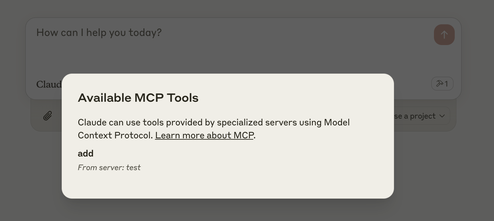

# Image Generation MCP Server on Cloudflare

An MCP (Model Context Protocol) server on Cloudflare Workers for AI-powered image generation, secured with Google OAuth authentication.

## Features

- 🖼️ **Image Generation Tool**: Generate images using AI models (Stable Diffusion XL, DALL-E 3)
- 🔐 **Google OAuth Authentication**: Secure access with Google OAuth 2.0
- 🍪 **Persistent Sessions**: Cookie-based session management
- 🌐 **Remote Access**: Deploy on Cloudflare Workers for global availability
- 👤 **User Context**: Pass authenticated user information to tools

## Google OAuth Setup

Before running the server, you need to set up Google OAuth:

1. Go to the [Google Cloud Console](https://console.cloud.google.com/)
2. Create a new project or select an existing one
3. Enable the Google+ API
4. Go to Credentials → Create Credentials → OAuth 2.0 Client ID
5. Application type: Web application
6. Add authorized redirect URIs:
   - For local development: `http://localhost:8787/callback`
   - For production: `https://your-worker-name.workers.dev/callback`
7. Copy the Client ID and Client Secret

## Develop locally

```bash
# clone the repository
git clone <your-repo-url>

# install dependencies
cd image-generation-mcp
npm install

# copy the environment variables example
cp .dev.vars.example .dev.vars

# edit .dev.vars and add your Google OAuth credentials
# GOOGLE_CLIENT_ID=your-actual-client-id
# GOOGLE_CLIENT_SECRET=your-actual-client-secret
# COOKIE_ENCRYPTION_KEY=generate-a-secure-random-string

# run locally
npm run dev
```

You should be able to open [`http://localhost:8787/`](http://localhost:8787/) in your browser

## Connect the MCP inspector to your server

To explore your new MCP api, you can use the [MCP Inspector](https://modelcontextprotocol.io/docs/tools/inspector).

- Start it with `npx @modelcontextprotocol/inspector`
- [Within the inspector](http://localhost:5173), switch the Transport Type to `SSE` and enter `http://localhost:8787/sse` as the URL of the MCP server to connect to, and click "Connect"
- You will navigate to a Google OAuth login screen. Click approve to authenticate with your Google account.
- You should be redirected back to the MCP Inspector and you can now list and call any defined tools!

<div align="center">
  
</div>

<div align="center">
  
</div>

## Connect Claude Desktop to your local MCP server

The MCP inspector is great, but we really want to connect this to Claude! Follow [Anthropic's Quickstart](https://modelcontextprotocol.io/quickstart/user) and within Claude Desktop go to Settings > Developer > Edit Config to find your configuration file.

Open the file in your text editor and replace it with this configuration:

```json
{
  "mcpServers": {
    "image-generation": {
      "command": "npx",
      "args": [
        "mcp-remote",
        "http://localhost:8787/sse"
      ]
    }
  }
}
```

This will run a local proxy and let Claude talk to your MCP server over HTTP

When you open Claude a browser window should open and allow you to login. You should see the tools available in the bottom right. Given the right prompt Claude should ask to call the tool.

<div align="center">
  
</div>

<div align="center">
  
</div>

## Deploy to Cloudflare

1. Create the KV namespace (if not already created):
   ```bash
   npx wrangler kv namespace create OAUTH_KV
   ```

2. Update the KV namespace ID in `wrangler.jsonc` with the ID from step 1

3. Set the production secrets:
   ```bash
   npx wrangler secret put GOOGLE_CLIENT_ID
   npx wrangler secret put GOOGLE_CLIENT_SECRET
   npx wrangler secret put COOKIE_ENCRYPTION_KEY
   # Optional:
   npx wrangler secret put ALLOWED_EMAILS
   npx wrangler secret put HOSTED_DOMAIN
   ```

4. Deploy:
   ```bash
   npm run deploy
   ```

## Call your newly deployed remote MCP server from a remote MCP client

Just like you did above in "Develop locally", run the MCP inspector:

`npx @modelcontextprotocol/inspector@latest`

Then enter the `workers.dev` URL (ex: `worker-name.account-name.workers.dev/sse`) of your Worker in the inspector as the URL of the MCP server to connect to, and click "Connect".

You've now connected to your MCP server from a remote MCP client.

## Connect Claude Desktop to your remote MCP server

Update the Claude configuration file to point to your `workers.dev` URL (ex: `worker-name.account-name.workers.dev/sse`) and restart Claude 

```json
{
  "mcpServers": {
    "image-generation": {
      "command": "npx",
      "args": [
        "mcp-remote",
        "https://image-generation-mcp.your-account.workers.dev/sse"
      ]
    }
  }
}
```

## Debugging

Should anything go wrong it can be helpful to restart Claude, or to try connecting directly to your
MCP server on the command line with the following command.

```bash
npx mcp-remote http://localhost:8787/sse
```

In some rare cases it may help to clear the files added to `~/.mcp-auth`

```bash
rm -rf ~/.mcp-auth
```
